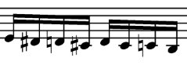

# NoteBox

## 계이름만 알면 MIDI를 연주해줍니다

말만하세요. MIDI를 연주하는 건 어려운 일도 아니니까요.

## 빌드 정보

Windows에서 동작합니다. 링크옵션에서 winmm.lib 의존성을 추가하세요.
-   **Visual Studio 2017:** 프로젝트 속성 > 구성속성 > 링커 > 입력 > 추가 종속성:(드롭다운메뉴) 편집 > winmm.lib 추가

## 사용방법

실행 후 악보를 입력하세요.

### 악보

악보의 각 음표는 "<음길이> <옥타브><음고>"로 표현됩니다.
-   **음길이:** 각 음표는 *음길이* x10ms만큼 연주됩니다. (자연수)
-   **옥타브:** *옥타브* 가 1만큼 커지면 음고가 7도 올라갑니다.   
                    Middle-C 는 0입니다. (음수를 포함한 정수)
-   **음고:** CDEFGAB로 표현합니다.   
                  옥타브와 함께 쓸 때 주의할 점은 0G 다음은 1A가 아닌 0A입니다.

Example:

 는 다음과 같이 나타냅니다.   
    6 0e 6 0em 6 0d 6 0dm 6 0d 6 0dm 6 0c 6 -1b   
    (16분음표가 60ms 동안 연주된다고 가정)

### 예시

-   떴다 떴다 비행기 :   
          75 0E 25 0D 50 0C 50 0D 50 0E 50 0E 100 0E   
          50 0D 50 0D 100 0D   
          50 0E 50 0G 100 0G   
          75 0E 25 0D 50 0C 50 0D 50 0E 50 0E 100 0E   
          50 0D 50 0D 75 0E 25 0D 50 0C
-   작은 별 :   
          30 0C 30 0C 30 0G 30 0G 30 0A 30 0A 50 0G   
          30 0F 30 0F 30 0E 30 0E 30 0D 30 0D 50 0C   
          30 0G 30 0G 30 0F 30 0F 30 0E 30 0E 50 0D   
          30 0G 30 0G 30 0F 30 0F 30 0E 30 0E 50 0D   
          30 0C 30 0C 30 0G 30 0G 30 0A 30 0A 50 0G   
          30 0F 30 0F 30 0E 30 0E 30 0D 30 0D 50 0C
-   왕벌의 비행(첫 24마디) :   
          7 3e 7 3em 7 3d 7 3dm 7 3d 7 3dm 7 3c 7 2b   
          7 3c 7 2b 7 2bm 7 2a 7 2am 7 2g 7 2gm 7 2f   
          7 2e 7 2em 7 2d 7 2dm 7 2d 7 2dm 7 2c 7 1b   
          7 2c 7 1b 7 1bm 7 1a 7 1am 7 1g 7 1gm 7 1f   
          7 1e 7 1em 7 1d 7 1dm 7 1d 7 1dm 7 1c 7 0b   
          7 1e 7 1em 7 1d 7 1dm 7 1d 7 1dm 7 1c 7 0b   
          7 1e 7 1em 7 1d 7 1dm 7 1d 7 1dm 7 1c 7 0b   
          7 1e 7 1em 7 1d 7 1dm 7 1d 7 1dm 7 1c 7 0b   
          7 1e 7 1em 7 1d 7 1dm 7 1c 7 1f 7 1e 7 1em   
          7 1e 7 1em 7 1d 7 1dm 7 1c 7 1dm 7 1d 7 1em   
          7 1e 7 1em 7 1d 7 1dm 7 1c 7 1f 7 1e 7 1em   
          7 1e 7 1em 7 1d 7 1dm 7 1c 7 1dm 7 1d 7 1em   
          7 1e 7 1em 7 1d 7 1dm 7 1d 7 1dm 7 1c 7 0b   
          7 1c 7 1dm 7 1d 7 1em 7 1e 7 1f 7 1e 7 1em   
          7 1e 7 1dm 7 1d 7 1dm 7 1d 7 1dm 7 1c 7 0b   
          7 1c 7 1dm 7 1d 7 1em 7 1e 7 1gm 7 1g 7 2am   
          7 1a 7 1am 7 1g 7 1gm 7 1f 7 1bm 7 1a 7 1am   
          7 1a 7 1am 7 1g 7 1gm 7 1f 7 1gm 7 1g 7 1am   
          7 1a 7 1am 7 1g 7 1gm 7 1f 7 1bm 7 1a 7 1am   
          7 1a 7 1am 7 1g 7 1gm 7 1f 7 1gm 7 1g 7 1am   
          7 1a 7 1am 7 1g 7 1gm 7 1g 7 1gm 7 1f 7 1e   
          7 1f 7 1gm 7 1g 7 1am 7 1a 7 1bm 7 1a 7 1am   
          7 1a 7 1am 7 1g 7 1gm 7 1g 7 1gm 7 1f 7 1e   
          7 1f 7 1gm 7 1g 7 1am 7 1a 7 1bm 7 1a 7 1am

## Todo List

-   **시험모드 / 작곡모드:** 시험모드 : 조금 더 간단한 명령으로 연주할 수 있음   
         작곡모드 : 박자와 bpm 등을 지정할 수 있음
-   **화음과 채널:** G음자리, C음자리 구현을 위해
-   **음계:** 다장조, 라단조 등
-   **GUI:**
